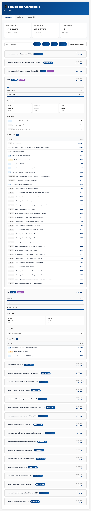
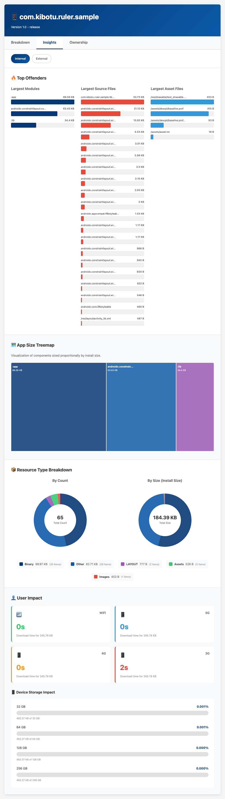
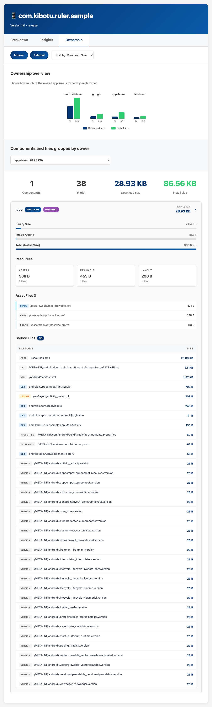

> Ruler is a fork of [Spotify's Ruler][upstream]. That project has not had meaningful
maintenance for over a year. This fork keeps the Android size analysis workflow alive and
replaces the multi-module Kotlin/React frontend with a single HTML template — the same
approach as [Caliper][caliper], its iOS equivalent, whose report format it matches.
Against upstream, the analysis runs faster and, measured on a medium-sized app, the HTML
report is about two thirds smaller and renders faster.


A Gradle plugin that measures the size of your Android app, file by file.

[](https://github.com/kibotu/ruler/actions/workflows/ci.yml)
[](https://central.sonatype.com/artifact/net.kibotu/ruler)
[](https://plugins.gradle.org/plugin/net.kibotu.ruler)
[](https://jitpack.io/#kibotu/ruler)
[](https://developer.android.com/build/releases/agp-9-3-0-release-notes)

Ruler builds your app bundle, splits it for one device, and reads every entry in the
resulting APKs. It attributes each class, resource, asset, and native library to the Gradle
module or Maven dependency that produced it. You get a JSON report for your tooling and a
self-contained HTML report for your team.

**[See a live HTML report →](https://kibotu.github.io/ruler/)**


<table>
  <tr valign="top">
    <td width="33%" align="center">
      <a href="docs/breakdown.png">
        
      </a>
      <br>
      <em>Module Size Breakdown</em>
    </td>
    <td width="33%" align="center">
      <a href="docs/insights.png">
        
      </a>
      <br>
      <em>Size Insights</em>
    </td>
    <td width="33%" align="center">
      <a href="docs/ownership.png">
        
      </a>
      <br>
      <em>Module Ownership</em>
    </td>
  </tr>
</table>

Quick start
-----------

Apply the plugin next to `com.android.application`:

```kotlin
// app/build.gradle.kts
plugins {
    id("com.android.application")
    id("net.kibotu.ruler") version "<latest>"
}
```

Ruler needs a device specification. It splits the bundle for that device, because app size
depends on the ABI, locale, density, and SDK level that the Play Store delivers:

```kotlin
// app/build.gradle.kts
ruler {
    abi.set("arm64-v8a")
    locale.set("en")
    screenDensity.set(480)
    sdkVersion.set(36)
}
```

Then run the task that Ruler adds for your variant:

```
$ ./gradlew analyzeReleaseBundle

> Task :app:analyzeReleaseBundle
> Task :app:printRulerReleaseReports
JSON report: file:///.../app/build/reports/ruler/release/report.json
HTML report: file:///.../app/build/reports/ruler/release/report.html
```

The paths are printed on every build, including when the analysis itself is up to date or comes
from the build cache.

There is one task per application variant, so `analyzeDebugBundle` works too. To measure on
every build, attach the task to `check`:

```kotlin
tasks.named("check") {
    dependsOn("analyzeReleaseBundle")
}
```

Requires JDK 17+. Built and tested against Gradle 9.7 and Android Gradle Plugin 9.3.

> **Resolving the plugin.** The snippet above resolves from the Gradle Plugin Portal. To take
> it from Maven Central instead, add `mavenCentral()` to `pluginManagement.repositories` in
> `settings.gradle.kts`. Until the first 3.0.0 release is published, install it into your local
> Maven repository with `./gradlew :ruler:publishToMavenLocal` and add `mavenLocal()` there.


Configuration
-------------

Beyond the device specification, everything is optional:

```kotlin
ruler {
    // Assign components and files to teams.
    ownershipFile.set(layout.projectDirectory.file("ownership.yaml"))
    defaultOwner.set("my-team")

    // Attribute files that Ruler cannot resolve on its own.
    staticDependenciesFile.set(layout.projectDirectory.file("static-dependencies.json"))

    // Report component totals only. Use this on very large apps.
    omitFileBreakdown.set(true)

    // Report native size per compile unit.
    bloatyPath.set("/usr/local/bin/bloaty")
    unstrippedNativeFiles.set(listOf(
        layout.projectDirectory.file("libs/arm64-v8a/libfoo.so"),
    ))

    // Fail the build above these sizes, in bytes.
    verification {
        downloadSizeThreshold = 15 * 1000 * 1000
        installSizeThreshold = 50 * 1000 * 1000
    }
}
```

| Property | Type | Default | Description |
|---|---|---|---|
| `abi` | `String` | required | Target ABI, such as `arm64-v8a`. |
| `locale` | `String` | required | Target locale, such as `en`. |
| `screenDensity` | `Int` | required | Target density in dpi, such as `480`. |
| `sdkVersion` | `Int` | required | Target SDK level. |
| `ownershipFile` | `RegularFile` | none | YAML file that maps names to owners. |
| `defaultOwner` | `String` | none | Owner for names that no entry matches. |
| `staticDependenciesFile` | `RegularFile` | none | JSON file of manual attribution rules. |
| `omitFileBreakdown` | `Boolean` | `false` | Omit the file lists from both reports. |
| `unstrippedNativeFiles` | `List<RegularFile>` | empty | Unstripped `.so` files for Bloaty. |
| `bloatyPath` | `String` | `which bloaty` | Path to the Bloaty executable. |
| `verification.downloadSizeThreshold` | `Long` | unlimited | Maximum download size in bytes. |
| `verification.installSizeThreshold` | `Long` | unlimited | Maximum install size in bytes. |


Features
--------

 * **Per-file breakdown.** Download size and install size for every class, resource, asset,
   and native library.
 * **Attribution.** Each file is assigned to its Gradle module or Maven dependency.
 * **Ownership.** Map modules, dependencies, and files to teams with a YAML file.
 * **De-obfuscation.** R8, ProGuard, and DexGuard mapping files are applied automatically.
 * **Dynamic features.** Each dynamic feature module is reported separately.
 * **Native deep-dive.** Optional [Bloaty][bloaty] integration reports native size per
   compile unit.
 * **Size limits.** Fail the build when download or install size exceeds a threshold.
 * **HTML report.** Treemap, top-20 lists, and owner breakdown in one offline file.
 * **Cacheable.** The task is a `@CacheableTask` and supports the configuration cache.


Reports
-------

Each task writes both reports side by side:

```
app/build/reports/ruler/release/
├── report.json
└── report.html
```

`report.html` is a single file with no external resources. It opens offline and contains a
treemap, a component table, size distributions by file type, top-20 lists, and per-owner
totals.

`report.json` is the machine-readable form:

```json
{
    "name": "com.kibotu.ruler.sample",
    "version": "1.0",
    "variant": "release",
    "downloadSize": 251690,
    "installSize": 473468,
    "components": [
        {
            "name": ":lib",
            "type": "INTERNAL",
            "downloadSize": 18168,
            "installSize": 35223,
            "files": [
                {
                    "name": "/res/layout/activity_lib.xml",
                    "type": "RESOURCE",
                    "downloadSize": 505,
                    "installSize": 487,
                    "owner": "app",
                    "additionalOwners": ["lib-team"],
                    "resourceType": "LAYOUT"
                }
            ],
            "owner": "app",
            "additionalOwners": ["lib-team"]
        }
    ],
    "dynamicFeatures": []
}
```

Components and files are sorted by download size, largest first. `files` is `null` when
`omitFileBreakdown` is set. A component `type` is `INTERNAL` or `EXTERNAL`. A file `type` is
`CLASS`, `RESOURCE`, `ASSET`, `NATIVE_LIB`, `NATIVE_FILE`, or `OTHER`, and a `RESOURCE`
carries a `resourceType` of `DRAWABLE`, `LAYOUT`, `FONT`, `RAW`, `VALUES`, or `OTHER`.
`owner`, `additionalOwners`, `internal`, and `resourceType` are left out where they have no
value, so treat a missing key as null.


Ownership
---------

List your teams in a YAML file. Ruler reads the entries in order and uses the first match.

```yaml
- identifier: :feature:login
  owner: auth-team

- identifier: "com.mycompany.*"
  owner: core-team
  internal: true

- identifier: androidx.constraintlayout:constraintlayout
  owner: google

- identifier: /res/layout/activity_main.xml
  owners:
    - ui-team
    - design-systems
```

`identifier` matches one of the following:

| Type | Example |
|---|---|
| Gradle module | `:feature:login` |
| Maven dependency | `com.squareup.okhttp3:okhttp` |
| Class | `com.mycompany.MainActivity` |
| Resource or asset path | `/res/layout/activity_main.xml` |
| Dynamic feature | `payments` |

Patterns support `*` for any characters and `?` for one character. Matches are
case-insensitive. A match on a file name overrides the owner of its component.

Use `owner` for a single team and `owners` for several. The first owner is the primary one;
the rest are reported alongside it as `additionalOwners`.

`internal` is optional. It overrides the report's internal/external flag, which is useful
when a Maven coordinate belongs to your own organisation.

Ruler tags the application module itself with the owner `App` when no entry matches it.


Static dependencies
-------------------

Some files have no dependency to attribute them to, such as generated assets or native
compile units. Map them yourself:

```json
[
    { "path": "lib/arm64-v8a/libfoo.so", "id": ":native:foo" },
    { "path": "assets/config.json", "id": ":config" }
]
```

`path` is a literal substring of the file path, not a pattern. When two entries match, the
longer `path` wins. Ruler applies these entries when automatic attribution fails. For native
compile units, Ruler applies them first.


Building
--------

```sh
./gradlew :ruler:build                 # Build and test the plugin.
./gradlew -p sample check              # Analyze the sample app end to end.
./gradlew :ruler:publishToMavenLocal   # Install into ~/.m2 for use in other projects.
```

`sample` is a separate Gradle build that includes this one, so it consumes Ruler exactly like a
real project does. Changes to the plugin take effect immediately. No publish step is needed. Being
a separate build, it finds the Android SDK through `ANDROID_HOME` or its own
`sample/local.properties`.

To work on the HTML report without an Android build:

```sh
./gradlew :ruler:previewReport
./gradlew :ruler:previewReport -Pjson=path/to/report.json
```

If Ruler saved you a few hours hunting down a bloated dependency (or a few megabytes),
consider [buying me a coffee](https://buymeacoffee.com/kibotu).

License
-------

Apache License 2.0. See [LICENSE](LICENSE).

 [bloaty]: https://github.com/google/bloaty
 [upstream]: https://github.com/spotify/ruler
 [caliper]: https://github.com/kibotu/caliper
