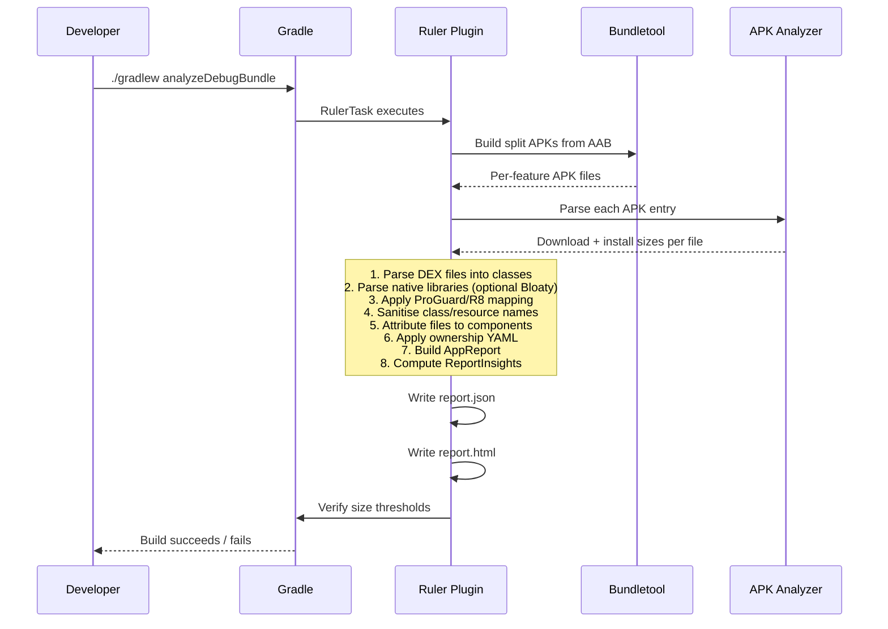
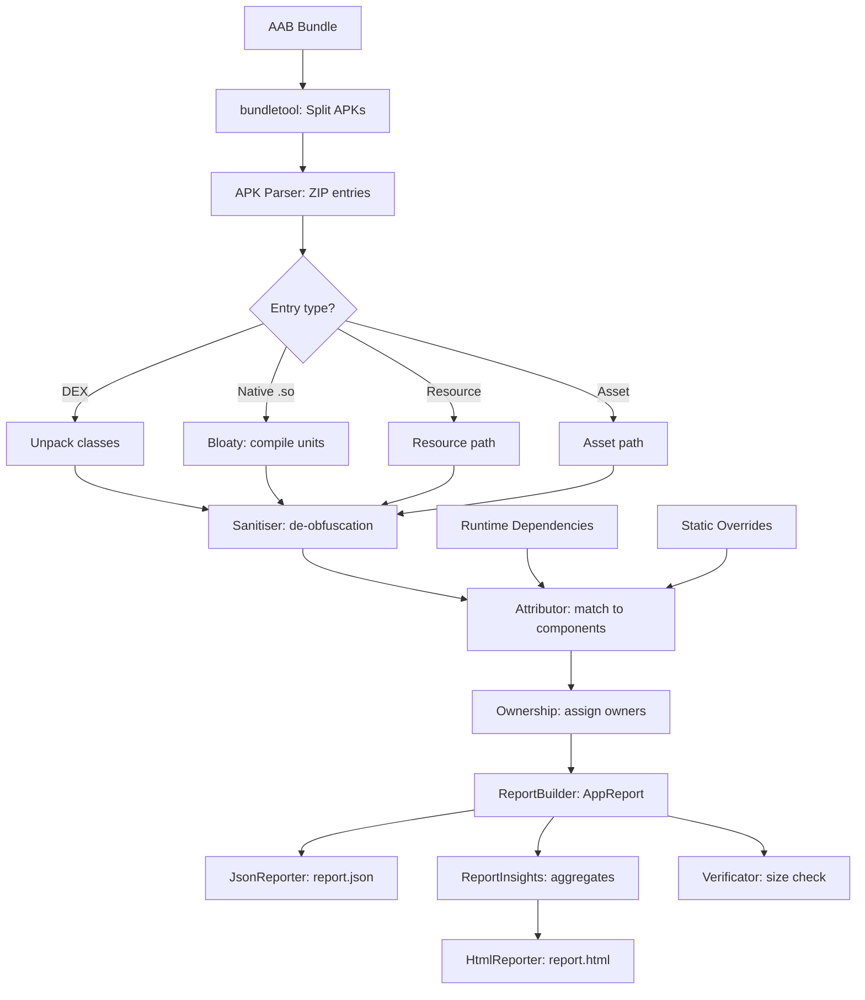

# Ruler

A Gradle plugin that analyses the size of your Android app at the file level. It produces both a machine-readable JSON report and a self-contained HTML report with treemaps, ownership breakdowns, and component/file top-N lists.

Ruler works by extracting your app bundle (AAB) into per-feature APKs via bundletool, parsing every entry (DEX classes, native libraries, resources, assets), attributing each file to the Gradle module or library dependency that produced it, and serialising the results.

---

## Features

- **Per-file size breakdown** -- download size and install size for every class, resource, asset, and native library.
- **Component attribution** -- files are grouped by their originating Gradle module or Maven dependency (internal vs. external).
- **Ownership tracking** -- map components and files to team owners via a YAML file.
- **Dynamic feature support** -- each dynamic feature module is reported separately.
- **ProGuard / DexGuard / R8 de-obfuscation** -- mapping files are applied automatically.
- **Native library deep-dive** -- optional Bloaty integration for compile-unit-level native size data.
- **Static dependency overrides** -- manually assign paths to components via a JSON file.
- **Size verification** -- fail the build when download or install size exceeds a threshold.
- **Self-contained HTML report** -- no external dependencies, works offline, embeds all data as JSON.
- **Treemap visualisation** -- hierarchical view of components and their files.
- **Ownership breakdown** -- per-owner aggregate of download/install size, component count, and file count.

---

## Project structure

```
ruler/
├── build.gradle.kts              # Root build (Kotlin, AGP, serialization plugins)
├── settings.gradle.kts           # Module includes + plugin resolution
├── gradle.properties             # Gradle daemon config
│
├── buildSrc/
│   └── src/main/kotlin/
│       ├── Dependencies.kt       # Centralised version catalog
│       └── Publish.kt            # Maven publishing + PGP signing helpers
│
├── ruler/                        # The plugin (single module)
│   ├── build.gradle.kts          # Shadow JAR, Gradle Plugin Portal publishing
│   └── src/
│       ├── main/
│       │   ├── kotlin/com/spotify/ruler/
│       │   │   ├── models/       # Data classes (AppReport, AppComponent, AppFile, ...)
│       │   │   ├── common/       # Core analysis engine
│       │   │   │   ├── apk/      # APK parsing, sanitisation, bundletool integration
│       │   │   │   ├── attribution/  # File-to-component attribution
│       │   │   │   ├── dependency/   # Dependency parsing and sanitisation
│       │   │   │   ├── ownership/    # YAML ownership file parsing
│       │   │   │   ├── report/       # JSON + HTML report generation
│       │   │   │   ├── sanitizer/    # Class name and resource name de-obfuscation
│       │   │   │   ├── models/       # Internal config models (AppInfo, DeviceSpec, RulerConfig)
│       │   │   │   ├── bloaty/       # Native library size analysis
│       │   │   │   ├── util/         # Regex utilities
│       │   │   │   └── veritication/ # Size threshold verification
│       │   │   └── plugin/       # Gradle plugin entry point
│       │   │       ├── RulerPlugin.kt
│       │   │       ├── RulerExtension.kt
│       │   │       ├── RulerVerificationExtension.kt
│       │   │       ├── RulerTask.kt
│       │   │       ├── FileProvider.kt
│       │   │       └── dependency/EntryParser.kt
│       │   └── resources/
│       │       ├── META-INF/gradle-plugins/net.kibotu.ruler.properties
│       │       ├── ruler-report.html    # HTML template
│       │       └── rulerDebug.keystore  # Debug signing key for split APKs
│       └── test/                 # Unit tests
│
└── sample/                       # Demo Android app (optional, gated behind -PwithSample)
    ├── app/
    └── lib/
```

---

## How it works



### Pipeline in detail

1. **Bundle extraction** -- `ApkCreator` uses bundletool to convert the AAB into split APKs for the target device spec (ABI, locale, density, SDK).
2. **APK parsing** -- `ApkParser` reads every ZIP entry, unpacks DEX files into individual classes, and optionally runs Bloaty on native libraries.
3. **Sanitisation** -- `ApkSanitizer` categorises entries (DEX, resources, assets, native libs, manifests) and applies de-obfuscation via `ClassNameSanitizer` (ProGuard/R8 mapping) and `ResourceNameSanitizer` (DexGuard resource mapping).
4. **Dependency resolution** -- `EntryParser` resolves all runtime dependencies through Gradle's artifact view API, producing a map of file paths to their declaring components.
5. **Attribution** -- `Attributor` matches each APK file against the dependency map using class name, resource path, asset path, or native library name heuristics. Unmatched files fall back to the app's own module.
6. **Ownership** -- `OwnershipFileParser` reads the YAML ownership file. `OwnershipInfo` resolves owners with explicit matches taking priority over wildcard matches.
7. **Report generation** -- `ReportBuilder` produces an `AppReport`. `ReportInsights` computes aggregate statistics. `JsonReporter` writes `report.json`. `HtmlReporter` embeds both into the HTML template.
8. **Verification** -- `Verificator` checks total download and install sizes against configured thresholds, throwing `SizeExceededException` on failure.

---

## Installation

### Gradle Plugin Portal

```kotlin
// settings.gradle.kts
plugins {
    id("net.kibotu.ruler") version "3.0.0"
}
```

```kotlin
// app/build.gradle.kts
plugins {
    id("com.android.application")
    id("net.kibotu.ruler")
}
```

### From source

```bash
cd ruler-overhaul
./gradlew :ruler:publishToMavenLocal
```

Then in your project:

```kotlin
// settings.gradle.kts
pluginManagement {
    repositories {
        mavenLocal()
        gradlePluginPortal()
    }
}

plugins {
    id("net.kibotu.ruler") version "3.0.0"
}
```

---

## Configuration

```kotlin
ruler {
    // Required: target device specification
    abi.set("arm64-v8a")           // Target ABI
    locale.set("en")               // Target locale
    screenDensity.set(480)         // Target screen density (dpi)
    sdkVersion.set(36)             // Target SDK version

    // Optional: ownership tracking
    ownershipFile.set(project.layout.projectDirectory.file("ownership.yaml"))
    defaultOwner.set("my-team")    // Fallback owner for unmatched items (default: unset/no owner)

    // Optional: static dependency overrides
    staticDependenciesFile.set(project.layout.projectDirectory.file("static-deps.json"))

    // Optional: skip per-file breakdown in report (component-level only)
    omitFileBreakdown.set(false)

    // Optional: unstripped native libraries for Bloaty analysis
    unstrippedNativeFiles.set(listOf(
        project.layout.projectDirectory.file("libs/arm64-v8a/libfoo.so")
    ))

    // Optional: size verification thresholds
    verification {
        downloadSizeThreshold = 15 * 1000 * 1000  // 15 MB in bytes
        installSizeThreshold = 50 * 1000 * 1000   // 50 MB in bytes
    }
}
```

### DSL reference

| Property | Type | Required | Default | Description |
|---|---|---|---|---|
| `abi` | `Property<String>` | Yes | -- | Target ABI (`arm64-v8a`, `armeabi-v7a`, `x86`, `x86_64`) |
| `locale` | `Property<String>` | Yes | -- | Target locale (`en`, `ja`, etc.) |
| `screenDensity` | `Property<Int>` | Yes | -- | Target screen density (`160`, `240`, `320`, `480`, `640`) |
| `sdkVersion` | `Property<Int>` | Yes | -- | Target SDK version |
| `ownershipFile` | `RegularFileProperty` | No | `null` | Path to YAML ownership file |
| `defaultOwner` | `Property<String>` | No | `""` (unset) | Fallback owner when no entry matches. If empty, unmatched items have no owner. |
| `staticDependenciesFile` | `RegularFileProperty` | No | `null` | Path to static dependency overrides JSON |
| `omitFileBreakdown` | `Property<Boolean>` | No | `false` | Omit per-file lists from report |
| `unstrippedNativeFiles` | `ListProperty<RegularFile>` | No | `[]` | Unstripped `.so` files for Bloaty |
| `verification.downloadSizeThreshold` | `Property<Long>` | No | `Long.MAX_VALUE` | Max download size in bytes |
| `verification.installSizeThreshold` | `Property<Long>` | No | `Long.MAX_VALUE` | Max install size in bytes |

---

## Running

### Per-variant tasks

The plugin registers a task for each Android application variant:

```bash
# Debug variant
./gradlew analyzeDebugBundle

# Release variant
./gradlew analyzeReleaseBundle
```

### Run as part of check

```kotlin
tasks.named("check").configure {
    dependsOn("analyzeDebugBundle")
    dependsOn("analyzeReleaseBundle")
}
```

### With the sample app

```bash
./gradlew :sample:app:analyzeDebugBundle -PwithSample
```

### Reports location

```
app/build/reports/ruler/
├── debug/
│   ├── report.json    # Machine-readable report
│   └── report.html    # Self-contained visual report
└── release/
    ├── report.json
    └── report.html
```

---

## Ownership file

Define ownership with a YAML file mapping identifiers to team owners:

```yaml
# Exact matches
- identifier: com.mycompany.MainActivity
  owner: app-team

- identifier: /res/layout/activity_main.xml
  owner: ui-team

- identifier: :feature:login
  owner: auth-team

# Glob patterns with * and ?
- identifier: "com.mycompany.*"
  owner: core-team
  internal: true

- identifier: "androidx.*"
  owner: google
  internal: true

- identifier: com.external:library
  owner: third-party
```

### Entry fields

| Field | Required | Description |
|---|---|---|
| `identifier` | Yes | Pattern to match component/file names. Supports glob-style `*` (any chars) and `?` (single char). |
| `owner` | Yes | Team name to assign when matched. |
| `internal` | No | Override for internal/external classification. When omitted, structural type is used. |

### Pattern syntax

- `*` matches any sequence of characters (e.g., `com.mycompany.*` matches `com.mycompany.Foo`)
- `?` matches a single character (e.g., `Feature?` matches `FeatureA`, `FeatureB`)
- Patterns are case-insensitive
- Entries are checked in YAML order; first match wins

### Matching rules

| Identifier type | Example | Matches |
|---|---|---|
| Fully qualified class | `com.mycompany.MainActivity` | Exact class |
| Resource path | `/res/layout/activity_main.xml` | Exact resource file |
| Module name | `:feature:login` | Gradle module |
| Dependency coordinate | `com.external:library` | Maven dependency (group:name) |
| Glob pattern | `com.mycompany.*` | Any name matching the pattern |

### Auto-tagging

When no ownership file is provided, or when no entry matches the app module, Ruler automatically tags the app component with `owner: "App"` and `internal: true`. Explicit ownership entries override this default.

---

## Static dependency overrides

For files that can't be automatically attributed (e.g., native libraries, generated code), provide a JSON overrides file:

```json
[
    { "path": "lib/arm64-v8a/libfoo.so", "id": ":native:foo" },
    { "path": "assets/config.json", "id": ":config" }
]
```

Each entry maps a file path (as a regex pattern) to a component ID. These override automatic attribution.

---

## Output format

### report.json

The JSON report follows this schema:

```json
{
    "name": "com.mycompany.app",
    "version": "1.2.3",
    "variant": "release",
    "downloadSize": 12345678,
    "installSize": 45678901,
    "components": [
        {
            "name": ":app",
            "type": "INTERNAL",
            "downloadSize": 5000000,
            "installSize": 20000000,
            "owner": "App",
            "internal": true,
            "files": [
                {
                    "name": "com.mycompany.MainActivity",
                    "type": "CLASS",
                    "downloadSize": 12000,
                    "installSize": 48000,
                    "owner": "app-team",
                    "resourceType": null
                }
            ]
        }
    ],
    "dynamicFeatures": [
        {
            "name": "dynamic",
            "downloadSize": 2000000,
            "installSize": 8000000,
            "owner": "dynamic-team",
            "internal": true,
            "files": []
        }
    ]
}
```

### Field reference

#### AppReport (root)

| Field | Type | Description |
|---|---|---|
| `name` | `String` | Application ID |
| `version` | `String` | Version name |
| `variant` | `String` | Build variant (`debug`, `release`) |
| `downloadSize` | `Long` | Total download size in bytes |
| `installSize` | `Long` | Total install size in bytes |
| `components` | `List<AppComponent>` | Components sorted by download size (descending) |
| `dynamicFeatures` | `List<DynamicFeature>` | Dynamic feature modules sorted by download size |

#### AppComponent

| Field | Type | Description |
|---|---|---|
| `name` | `String` | Module path (`:app`) or dependency coordinate (`com.ext:lib`) |
| `type` | `ComponentType` | `INTERNAL` (project module) or `EXTERNAL` (library) |
| `downloadSize` | `Long` | Component download size in bytes |
| `internal` | `Boolean?` | Override from ownership file. When set, used for internal/external filtering instead of `type`. |
| `installSize` | `Long` | Component install size in bytes |
| `owner` | `String?` | Assigned owner from ownership file |
| `files` | `List<AppFile>?` | Files sorted by download size (descending). `null` if `omitFileBreakdown` is true |

#### AppFile

| Field | Type | Description |
|---|---|---|
| `name` | `String` | Class name (`com.foo.Bar`), resource path (`/res/layout/main.xml`), or asset/native path |
| `type` | `FileType` | `CLASS`, `RESOURCE`, `ASSET`, `NATIVE_LIB`, `NATIVE_FILE`, or `OTHER` |
| `downloadSize` | `Long` | File download size in bytes |
| `installSize` | `Long` | File install size in bytes |
| `owner` | `String?` | Assigned owner from ownership file |
| `resourceType` | `ResourceType?` | `DRAWABLE`, `LAYOUT`, `FONT`, `RAW`, `VALUES`, `OTHER`, or `null` |

#### Enums

**ComponentType:** `INTERNAL`, `EXTERNAL`

**FileType:** `CLASS`, `RESOURCE`, `ASSET`, `NATIVE_LIB`, `NATIVE_FILE`, `OTHER`

**ResourceType:** `DRAWABLE`, `LAYOUT`, `FONT`, `RAW`, `VALUES`, `OTHER`

### report.html

The HTML report is a single self-contained file. It embeds the JSON report and pre-computed insights (`ReportInsights`) as JSON in `<script>` tags. No external resources are loaded -- it works offline.

The HTML report includes:
- Total app size (download + install)
- Component breakdown table (sorted by size)
- File type distribution
- Resource type distribution
- Top 20 components and files by download/install size
- Ownership breakdown with per-owner aggregates
- Treemap visualisation (up to 50 components, 30 files each)

---

## Data flow



---

## Requirements

- **Gradle** 8.x+
- **Android Gradle Plugin** 8.x+
- **JVM** 17+ (for running Gradle)
- **Android SDK** with build-tools installed

---

## Building from source

```bash
git clone https://github.com/kibotu/ruler.git
cd ruler/ruler-overhaul

# Build the plugin
./gradlew :ruler:build

# Run tests
./gradlew :ruler:test

# Publish to mavenLocal for local testing
./gradlew :ruler:publishToMavenLocal

# Build sample app (after publishing to mavenLocal)
./gradlew :sample:app:assembleDebug -PwithSample
```

---

## License

Apache License 2.0. See [LICENSE](LICENSE) for details.
